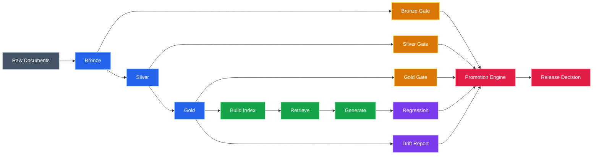
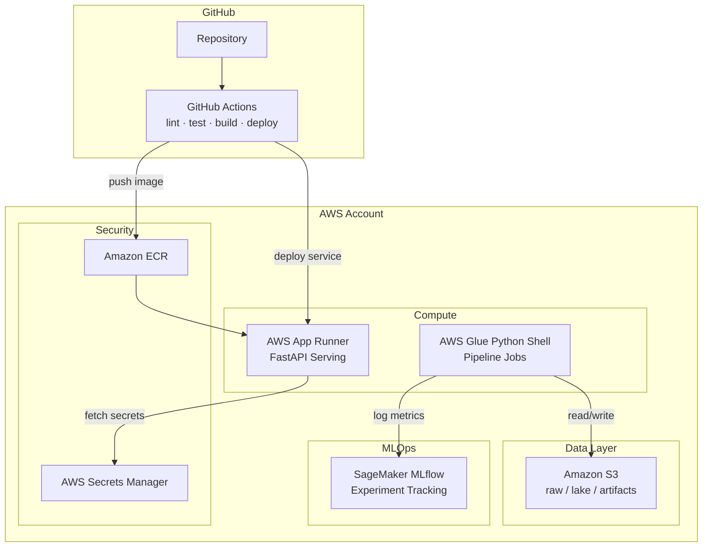

# lakehouse-mlops-agentic-qa

An end-to-end MLOps platform for a RAG-based QA system, built on a medallion lakehouse architecture. The project demonstrates production data engineering and ML deployment practices — from raw document ingestion through quality gates, retrieval-augmented generation, regression testing, drift monitoring, and automated promotion decisions.

Runs locally with zero cloud dependencies for fast iteration, and deploys to AWS as a lakehouse MLOps platform (S3, Glue, SageMaker MLflow, App Runner) via CloudFormation IaC and GitHub Actions CI/CD.

## Why this project matters

Production ML systems fail silently. A model that passed all tests last week can degrade today because the underlying data shifted, a document was dropped from the corpus, or an upstream schema changed. Most MLOps demos stop at "deploy the model." This project simulates what happens *after* deployment: how do you know the system is still good enough to serve?

The pipeline implements the practices that distinguish production ML from notebook ML:

- **Data quality gates** that block bad data before it reaches the model
- **Regression tests** with deterministic assertions that catch answer degradation
- **Drift detection** that flags distribution shifts in the data layer
- **Automated promotion logic** that makes reject/canary/production decisions from evidence, not intuition

The RAG system is intentionally simple. The engineering around it — the pipeline, the gates, the evaluation harness, the decision engine — is the point.

## Architecture



## AWS architecture

The local-first design maps directly to AWS services for production deployment:



| Local component | AWS service | Notes |
|----------------|-------------|-------|
| `data/raw/`, `data/lake/` | Amazon S3 | Prefix-based medallion layout in a single bucket |
| `artifacts/` | S3 + SageMaker MLflow | Artifacts in S3, metrics via managed MLflow |
| Pipeline CLI (`lmq pipeline run`) | AWS Glue Python Shell job | Same Python package, serverless compute |
| FastAPI server | AWS App Runner | Containerized, auto-scaling, direct ECR integration |
| `OPENAI_API_KEY` env var | AWS Secrets Manager | Secrets fetched at startup, env var fallback |
| JSON artifacts | SageMaker MLflow (optional) | Pipeline runs, regression, promotion tracked |
| — | GitHub Actions | Lint → test → build → push → deploy |
| — | CloudFormation IaC (`infra/`) | All AWS resources declared as code |

## Folder structure

```text
lakehouse-mlops-agentic-qa/
├── .github/workflows/
│   └── ci.yml                    # GitHub Actions: lint, test, build, deploy
├── configs/
│   ├── pipeline.yaml             # local paths, thresholds, and promotion rules
│   └── pipeline.aws.yaml         # AWS paths (S3 bucket prefixes)
├── data/
│   ├── raw/                      # source documents (.md, .txt)
│   ├── raw_fail/                 # intentionally bad input for gate demos
│   └── lake/                     # generated Parquet (gitignored)
│       ├── bronze/
│       ├── silver/
│       └── gold/
├── infra/
│   └── cloudformation.yaml       # AWS resources (S3, Secrets Manager, ECR, App Runner)
├── notebooks/
│   └── glue_pipeline.py          # AWS Glue Python Shell job wrapper
├── src/lmq/
│   ├── cloud/                    # AWS integrations (all optional)
│   │   ├── s3_storage.py         # S3 storage_options helper
│   │   ├── secrets_manager.py    # Secrets Manager secret loader
│   │   └── mlflow_log.py         # MLflow experiment tracking
│   ├── pipeline/                 # bronze, silver, gold, DuckDB smoke, manifest
│   ├── quality/                  # per-layer gate checks and models
│   ├── rag/                      # chunking, ChromaDB index, retrieve, generate
│   ├── agent/                    # minimal retrieve-then-generate orchestrator
│   ├── serving/                  # FastAPI app (GET /health, POST /v1/qa)
│   ├── eval/                     # regression runner and scoring metrics
│   ├── monitoring/               # Evidently drift + quality reports
│   ├── promotion/                # rules-based promotion engine
│   ├── cli/                      # Typer CLI (all commands)
│   └── config.py                 # Pydantic config models
├── tests/
│   ├── golden/                   # qa_pairs.jsonl golden set
│   ├── test_api.py               # FastAPI endpoint tests
│   ├── test_evidently.py         # Evidently report generation test
│   ├── test_metrics.py           # scoring function unit tests
│   ├── test_promotion.py         # promotion engine rule tests
│   └── test_regression.py        # regression runner integration test
├── artifacts/                    # all generated artifacts (gitignored)
│   ├── runs/                     # *_run_manifest.json
│   ├── gates/                    # per-layer gate JSONs
│   ├── chroma/                   # ChromaDB vector index
│   ├── regression/               # *_regression.json
│   ├── evidently/                # HTML report + JSON summary
│   └── promotion/                # *_promotion.json
├── Dockerfile                    # multi-stage build for App Runner
├── pyproject.toml
└── README.md
```

## Setup

Requires Python 3.11+.

```bash
git clone <repo-url> && cd lakehouse-mlops-agentic-qa
python -m venv .venv

# Linux / macOS
source .venv/bin/activate
pip install -U pip && pip install -e ".[dev]"

# Windows PowerShell
.\.venv\Scripts\python -m pip install -U pip
.\.venv\Scripts\pip install -e ".[dev]"
```

The first `lmq qa build-index` will download the `all-MiniLM-L6-v2` ONNX model (~80 MB) to a local cache. No API keys are required — the QA system runs in offline stub mode by default.

## Pipeline flow

The medallion pipeline reads `.md` and `.txt` files from `data/raw/`, transforms them through three layers of increasing quality, and writes Parquet files under `data/lake/`. Each layer transition passes through a quality gate that can fail the entire run.

```bash
lmq pipeline run
```

**Bronze** ingests raw files as-is with metadata. **Silver** cleans and normalizes text, deduplicates by `doc_id`, and computes a content hash. **Gold** splits clean text into fixed-size chunks ready for indexing.

Each run produces:
- Parquet files at `data/lake/{bronze,silver,gold}/`
- Gate results at `artifacts/gates/<layer>_<run_id>.json`
- A run manifest at `artifacts/runs/<run_id>_run_manifest.json` with DuckDB smoke-check metadata

To trigger a gate failure, point the pipeline at the intentionally bad input:

```bash
lmq pipeline run --raw-dir data/raw_fail
```

The bronze gate detects the empty document and exits with code 2.

## QA flow

Build a ChromaDB vector index from the gold layer, then ask questions:

```bash
lmq qa build-index
lmq qa ask "What are quality gates in MLOps?"
```

In offline stub mode (default, no API key needed), the answer is assembled from the top retrieved chunks with source metadata. If `OPENAI_API_KEY` is set, the system calls an OpenAI-compatible API to generate a natural-language answer grounded in the same retrieved context.

## Regression testing

A golden set of question/expected-keyword pairs lives at `tests/golden/qa_pairs.jsonl`. The regression runner executes each question against the index, checks that expected keywords appear in the answer, and writes a JSON artifact with per-case pass/fail and an aggregate pass rate.

```bash
lmq eval regression
```

The same checks run under pytest:

```bash
pytest tests -v
```

## Evidently reporting

Generates a data-drift and data-quality report by comparing two gold Parquet snapshots. The report uses tabular features derived from the gold layer (chunk length, token count, chunk index) so Evidently can run standard statistical tests without touching embeddings.

```bash
# Self-comparison (zero drift, good for verifying the setup)
lmq report evidently

# Baseline vs current comparison
lmq report evidently --baseline data/lake/gold/gold_baseline.parquet --current data/lake/gold/gold.parquet
```

The HTML report is written to `artifacts/evidently/evidently_report.html` and can be opened in any browser. A machine-readable JSON summary is written alongside it.

## Promotion decision

The promotion engine reads the latest run manifest, regression report, and Evidently summary, then applies config-driven rules to produce a reject, canary, or production decision.

```bash
lmq release evaluate
```

The rules (configured in `configs/pipeline.yaml`):

| Condition | Decision |
|-----------|----------|
| Pipeline failed, any gate failed, regression below canary threshold, or drift exceeds limit | **reject** |
| Regression between canary and production thresholds | **canary** |
| All checks green, regression at or above production threshold | **production** |

The decision, reasons, thresholds used, and input values are written to `artifacts/promotion/<timestamp>_promotion.json`.

## FastAPI server

A thin wrapper over the same QA code path used by the CLI:

```bash
lmq serve
# Server runs at http://127.0.0.1:8000
# Interactive docs at http://127.0.0.1:8000/docs
```

Endpoints:
- `GET /health` — returns `{ "status": "ok", "version": "0.1.0" }`
- `POST /v1/qa` — accepts `{ "question": "...", "top_k": 3 }`, returns answer + sources + mode

## Demo walkthrough

### Successful production path

Run the full pipeline, build the index, run regression, generate an Evidently report, and evaluate for promotion:

```bash
lmq pipeline run
lmq qa build-index
lmq eval regression
lmq report evidently
lmq release evaluate
```

Expected output from `lmq release evaluate`:

```
Decision:  PRODUCTION
Reasons:
  - all checks passed
```

### Failure and reject path

Run the regression against a golden set that includes an impossible question (about Kubernetes, which is not in the corpus):

```bash
lmq eval regression --golden tests/golden/qa_pairs_fail.jsonl
lmq release evaluate
```

Expected output:

```
Decision:  REJECT
Reasons:
  - regression pass rate 50.0% < canary minimum 75.0%
```

The promotion engine picked up the latest regression artifact (which now has a 50% pass rate) and rejected the release. Restore the good state by re-running the standard regression:

```bash
lmq eval regression
lmq release evaluate
# Decision:  PRODUCTION
```

## CLI reference

```text
lmq pipeline run    [--config PATH] [--raw-dir PATH]
lmq qa build-index  [--config PATH]
lmq qa ask          QUESTION [--config PATH] [--top-k N]
lmq eval regression [--config PATH] [--golden PATH] [--top-k N]
lmq report evidently [--config PATH] [--baseline PATH] [--current PATH]
lmq release evaluate [--config PATH]
lmq serve           [--config PATH] [--host HOST] [--port PORT]
lmq version
```

## Running tests

```bash
pytest tests -v
```

21 tests covering quality gates, scoring metrics, regression runner, FastAPI endpoints, Evidently report generation, and all promotion engine decision paths.

## Deploy to AWS

> **Quick start:** See [`DEPLOY_AWS.md`](DEPLOY_AWS.md) for a step-by-step walkthrough that takes the locally-built Docker image to a live App Runner URL in ~15 minutes.

The quick-deploy path (manual ECR + App Runner) requires only the AWS CLI — no CloudFormation, no GitHub Actions. For the full automated setup, continue below.

### Full infrastructure (CloudFormation)

Provisions S3, Secrets Manager, ECR, IAM roles, and App Runner in a single stack:

```bash
aws cloudformation deploy \
  --stack-name lmq \
  --template-file infra/cloudformation.yaml \
  --capabilities CAPABILITY_NAMED_IAM
```

Retrieve the outputs after the stack completes:

```bash
aws cloudformation describe-stacks \
  --stack-name lmq \
  --query 'Stacks[0].Outputs'
```

### Store secrets

```bash
aws secretsmanager put-secret-value \
  --secret-id lmq/openai \
  --secret-string '{"OPENAI_API_KEY": "sk-..."}'
```

### GitHub Actions CI/CD

Configure these in your repository settings to enable automated deployments on push to main:

| Secret / Variable | Value |
|-------------------|-------|
| `AWS_ROLE_ARN` (secret) | ARN of the GitHub Actions OIDC role |
| `ECR_REPOSITORY` (variable) | e.g. `lmq` |
| `APPRUNNER_SERVICE_ARN` (variable) | From CloudFormation output `AppRunnerServiceArn` |
| `APPRUNNER_ACCESS_ROLE_ARN` (variable) | From CloudFormation output (IAM role for ECR access) |

The workflow runs: lint → test → Docker build → push to ECR → deploy new App Runner revision.

### Run the pipeline in AWS Glue (optional)

Upload the `lmq` wheel to S3, create a Glue Python Shell job referencing `notebooks/glue_pipeline.py`, and pass `--S3_BUCKET` and `--AWS_REGION` as job parameters. Connect a SageMaker MLflow tracking server for persistent experiment tracking.

### Docker (local)

```bash
docker build -t lmq .
docker run -p 8000:8000 lmq
# API at http://localhost:8000/docs

# Run the pipeline inside the container
docker run lmq pipeline run
```

## Limitations

- **Stub LLM mode.** Without an API key, the QA system returns raw retrieved chunks instead of generated answers. This is intentional: it keeps the regression tests deterministic and the project runnable offline.
- **Small corpus.** The seed documents are three Markdown files. The architecture works the same way with thousands of documents, but the demo is designed to run in seconds.
- **Character-based chunking.** The gold layer uses simple fixed-size character splits. A production system would use semantic or sentence-boundary chunking.
- **No embedding drift.** Evidently reports use tabular features (chunk length, token count) rather than embedding vectors. This avoids heavyweight PCA but means the drift detection does not catch semantic shifts.
- **ChromaDB stays local.** The vector index runs inside the container. A production deployment would replace it with Amazon OpenSearch Service or Amazon Bedrock Knowledge Bases.
- **No real canary traffic splitting.** The promotion engine writes a JSON decision — it does not actually route traffic. App Runner revision-based traffic splitting or an ALB weighted target group would be the natural next step.

## Future improvements

- Sentence-boundary or semantic chunking in the gold layer
- LLM-as-judge evaluation alongside keyword recall
- Embedding drift via PCA-reduced vectors in Evidently
- Amazon OpenSearch Service or Bedrock Knowledge Bases replacing ChromaDB
- Human-in-the-loop approval UI for canary decisions
- Versioned gold snapshots for reproducible baseline comparisons
- Multi-model comparison in the regression runner
- SageMaker MLflow tracking server for managed experiment logging
